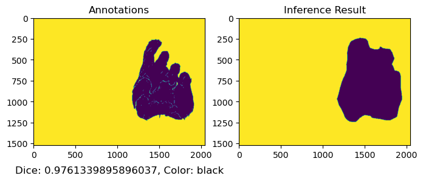

```python
import Ipynb_importer 
import color_function as cf

import matplotlib.pyplot as plt
import matplotlib.image as mpimg
import numpy as np
import pandas as pd
```

載入圖片


```python
im1_annotations = mpimg.imread(r'C:\Users\B20770\Desktop\Lin\ESD-USB\Dice計算\annotations\1531727270000.png')
im2_annotations = mpimg.imread(r'C:\Users\B20770\Desktop\Lin\ESD-USB\Dice計算\annotations\1534297416000.png')
im1_inference_result = mpimg.imread(r'C:\Users\B20770\Desktop\Lin\ESD-USB\Dice計算\inference_result\1531727270000.png')
im2_inference_result = mpimg.imread(r'C:\Users\B20770\Desktop\Lin\ESD-USB\Dice計算\inference_result\1534297416000.png')
```


```python
cf.Dice_function(im1_annotations,im1_inference_result)
```


    

    


    

    


    

    


    

    


<div>
<style scoped>
    .dataframe tbody tr th:only-of-type {
        vertical-align: middle;
    }

    .dataframe tbody tr th {
        vertical-align: top;
    }

    .dataframe thead th {
        text-align: right;
    }
</style>
<table border="1" class="dataframe">
  <thead>
    <tr style="text-align: right;">
      <th></th>
      <th>Color</th>
      <th>Dice Coefficient</th>
    </tr>
  </thead>
  <tbody>
    <tr>
      <th>0</th>
      <td>yellow</td>
      <td>0.646622</td>
    </tr>
    <tr>
      <th>1</th>
      <td>black</td>
      <td>0.995884</td>
    </tr>
    <tr>
      <th>2</th>
      <td>red</td>
      <td>0.792781</td>
    </tr>
    <tr>
      <th>3</th>
      <td>blue</td>
      <td>0.000000</td>
    </tr>
  </tbody>
</table>
</div>


```python
cf.Dice_function(im2_annotations,im2_inference_result)
```


    

    


    

    


    

    


    

    


    

    


<div>
<style scoped>
    .dataframe tbody tr th:only-of-type {
        vertical-align: middle;
    }

    .dataframe tbody tr th {
        vertical-align: top;
    }

    .dataframe thead th {
        text-align: right;
    }
</style>
<table border="1" class="dataframe">
  <thead>
    <tr style="text-align: right;">
      <th></th>
      <th>Color</th>
      <th>Dice Coefficient</th>
    </tr>
  </thead>
  <tbody>
    <tr>
      <th>0</th>
      <td>yellow</td>
      <td>0.741177</td>
    </tr>
    <tr>
      <th>1</th>
      <td>blue</td>
      <td>0.814868</td>
    </tr>
    <tr>
      <th>2</th>
      <td>black</td>
      <td>0.976134</td>
    </tr>
    <tr>
      <th>3</th>
      <td>red</td>
      <td>0.868805</td>
    </tr>
  </tbody>
</table>
</div>


```python

```
